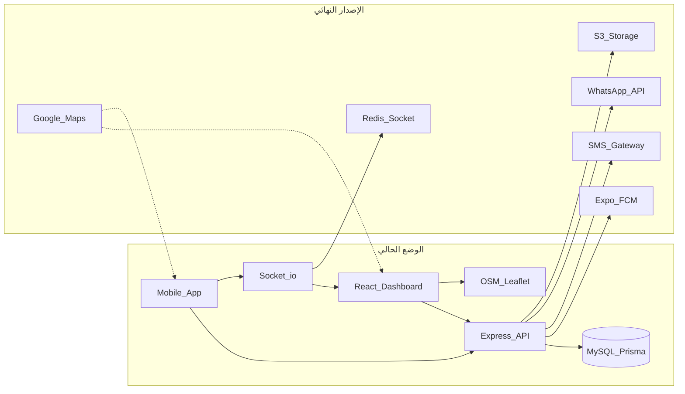
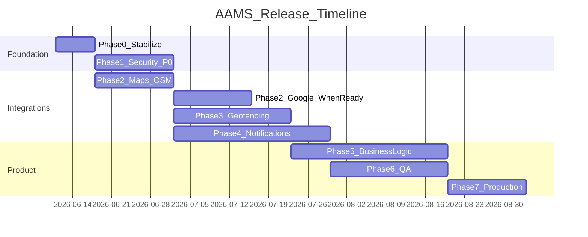

# خطة الإصدار النهائي — AAMS

## الوضع الحالي (بعد نجاح الـ Demo)

- **موبايل → API → داشبورد** يعمل على المسارات الأساسية (شفت، وقود، تقارير، حوادث، صيانة، منصات، إجازات).
- إصلاحات رفع الملفات الأخيرة: incidents، platform accounts، daily reports screenshots، HEIC.
- [`GET /dashboard/driver`](backend/src/modules/dashboard/routes.js) يجمع إحصائيات + `recentReports` في response واحد.
- **غير جاهز للإنتاج النهائي** بدون: تأمين الصلاحيات، geofencing فعلي، إشعارات مربوطة بالأحداث، تكامل Google Maps، وrunbook deploy.



---

## مخرجات المشروع (Deliverables)

| المخرج | المسار المقترح |
|--------|----------------|
| **ملف الخطة الرئيسي** | [`docs/ROADMAP.md`](docs/ROADMAP.md) — يُنشأ بعد اعتماد هذه الخطة |
| **قائمة تسليمات العميل** | قسم داخل `ROADMAP.md` + [`docs/CLIENT_DELIVERABLES.md`](docs/CLIENT_DELIVERABLES.md) |
| **Runbook الإنتاج** | [`docs/PRODUCTION_DEPLOY.md`](docs/PRODUCTION_DEPLOY.md) |
| **تحديث المتطلبات** | [`aams_requirements_audit.md`](aams_requirements_audit.md) — مزامنة مع الواقع |
| **توثيق الموبايل** | [`backend/docs/MOBILE_API.md`](backend/docs/MOBILE_API.md) — geofencing + socket + push |

---

## ما ننتظره من العميل (Client Deliverables)

### خرائط (Google Maps — مرحلة لاحقة فوق OSM)
- Google Maps API Key (Maps JavaScript / Places حسب الحاجة)
- تقييد المفتاح بالدومين + bundle ID للموبايل
- قرار: هل الموبايل يستخدم Google Maps SDK أم WebView؟

### إشعارات (Push + SMS + WhatsApp)
- **Expo:** `EXPO_ACCESS_TOKEN` + EAS project
- **FCM:** Service Account JSON (HTTP v1 — ليس legacy key فقط)
- **APNs:** شهادات iOS (عبر Expo أو مباشرة)
- **SMS:** مزود (Twilio / Unifonic / Msegat…) + API keys + sender ID
- **WhatsApp:** Business API (Meta Cloud API أو مزود) + templates معتمدة

### بنية تحتية
- `CORS_ORIGIN` للداشبورد
- MySQL production + backups
- S3/MinIO (`STORAGE_DRIVER=s3`) للملفات
- Redis (لـ Socket.io multi-instance + throttle)
- TLS + domain نهائي

---

## المراحل (Phases)

### المرحلة 0 — تثبيت ما بعد الـ Demo (أسبوع 1)
**هدف:** تجميد baseline مستقر على السيرفر.

- Deploy آخر backend + dashboard (كل إصلاحات الرفع والتقارير).
- إنشاء [`docs/ROADMAP.md`](docs/ROADMAP.md) ونسخ هذه الخطة إليه.
- إنشاء [`backend/.env.example`](backend/.env.example) من [`backend/src/config/index.js`](backend/src/config/index.js).
- تحديث [`aams_requirements_audit.md`](aams_requirements_audit.md) (Socket، cron، driver dashboard — أصبحت موجودة).
- Tag git: `v0.9-demo-stable`.

---

### المرحلة 1 — أمان الإنتاج P0 (أسبوع 1–2) — **blocking**

**المشكلة:** [`sharedPerm`](backend/src/middlewares/adminGuard.js) يتجاوز RBAC لـ `APP_USER`؛ mutations إدارية مفتوحة على routes السائق.

**الإجراءات:**
1. **فصل المسارات:** `adminPerm` لـ review/verify/delete/status؛ `sharedPerm` للقراءة وإنشاء السجل الخاص فقط.
2. **ملفات أولوية:**
   - [`backend/src/modules/documents/service.js`](backend/src/modules/documents/service.js) — scoping في `list`/`getExpiring` مثل licenses
   - [`backend/src/modules/reports/routes.js`](backend/src/modules/reports/routes.js) — منع السائق من fleet-wide analytics
   - [`backend/src/modules/platformAccounts/service.js`](backend/src/modules/platformAccounts/service.js) — `verify()` admin-only
   - violations, dailyReports, maintenance, vehicles, ratings — نفس النمط
3. **Socket auth:** JWT في handshake لـ [`backend/src/socket/index.js`](backend/src/socket/index.js) + [`trackingHandler.js`](backend/src/socket/trackingHandler.js)
4. **إنتاج:** إلغاء `STATIC_OTP`، تغيير كلمات seed الافتراضية، `CORS_ORIGIN` صحيح.

**معيار القبول:** سائق يحصل 403 على أي mutation إدارية؛ تقارير fleet محصورة بالأدمن.

---

### المرحلة 2 — خرائط: OSM الآن + Google لاحقاً (أسبوع 2–4)

**الآن (بدون مفتاح Google):**
- الإبقاء على Leaflet + OSM في [`VehicleLiveMap.jsx`](dashboard/src/pages/vehicles/VehicleLiveMap.jsx) و [`DriverLiveMap.jsx`](dashboard/src/pages/drivers/DriverLiveMap.jsx).
- توثيق socket + REST في [`MOBILE_API.md`](backend/docs/MOBILE_API.md).
- رسم Zone polygons على الداشبورد من `Zone.boundary` (GeoJSON في schema).

**عند تسليم Google Maps API:**
- Dashboard: طبقة Google Maps اختيارية عبر env `VITE_MAP_PROVIDER=google|osm`.
- Mobile: توثيق فقط (لا repo موبايل هنا) — العميل/فريق الموبايل يربط SDK.
- Geocoding/reverse-geocoding اختياري في backend إن طُلب.

---

### المرحلة 3 — Geofencing والتتبع الحي (أسبوع 3–5)

**الملفات:** [`geofencing/service.js`](backend/src/modules/geofencing/service.js), [`socket/trackingHandler.js`](backend/src/socket/trackingHandler.js)

| ميزة | العمل |
|------|------|
| Point-in-polygon | عند `POST /geofencing/locations` — فحص الدخول/الخروج من Zone |
| تنبيه منطقة محظورة | إنشاء Notification + push عند breach |
| ربط بالشفت | رفض/تجاهل locations بدون شفت ACTIVE |
| Idle 40 دقيقة | cron يفحص آخر `lastLocationAt` |
| Disconnect heartbeat | تنبيه إن لا تحديث GPS خلال N دقيقة |
| Redis adapter | Socket.io + throttle map عبر Redis للـ multi-instance |

**تحسين منطق (من المتطلبات):**
- 6.3 «تحرك 1 كم لتفعيل الشفت» — اختياري في [`shifts/service.js`](backend/src/modules/shifts/service.js)
- 6.12 حد 6 ساعات لإنهاء الشفت — validation في end shift

---

### المرحلة 4 — الإشعارات: Push + SMS + WhatsApp (أسبوع 4–6)

**الملفات:** [`pushService.js`](backend/src/services/pushService.js), [`notifications/routes.js`](backend/src/modules/notifications/routes.js), جديد: `notificationDispatcher.js`

**عند تسليم credentials:**

1. **Push:** ترقية FCM إلى HTTP v1؛ الإبقاء على Expo.
2. **SMS / WhatsApp:** طبقة `channels/smsProvider.js`, `channels/whatsappProvider.js` — واجهة موحدة.
3. **ربط بالأحداث (event-driven):**

| الحدث | قنوات |
|-------|-------|
| موافقة/رفض شفت | Push |
| فتح تحقيق | Push + (SMS اختياري) |
| مستند قارب الانتهاء | Push (cron موجود) |
| مخالفة جديدة | Push |
| طلب إجازة/سلفة | Push للمشرف/HR |
| خروج من geofence | Push |
| تأخر بدء الشفت | Push + SMS |

4. **Templates:** استخدام `NotificationTemplate` مع `titleAr`/`bodyAr` + locale المستخدم.
5. **Validators** لـ send/broadcast/templates.

---

### المرحلة 5 — منطق الأعمال من الـ Audit (أسبوع 5–8)

أولويات من [`aams_requirements_audit.md`](aams_requirements_audit.md):

| # | المتطلب | الملفات |
|---|---------|---------|
| 4.5 | وقود ثاني مشروط بأداء الطلبات | `fuelLogs/service.js` |
| 4.6 | إيصال وقود إلزامي | `fuelLogs` validator + service |
| 7.7 | مرفق إجازة مرضية إلزامي | `leaveRequests/service.js` |
| 5.5 | تتبع أداء حساب المنصة | `platformAccounts` + `shifts` aggregate API |
| 8.5 | تقييم تلقائي من مخالفات | `ratings/service.js` + cron |
| 9.2 | تنبيه أداء منخفض | cron + notifications |
| 10.x | تقارير مركبة متقدمة | `reports/service.js` — scoping + فلاتر |

**تحسينات logic إضافية (مقترحة):**
- `achievementRate` في dashboard/driver: الإبقاء على حساب «تقارير/شفتات منتهية» (تم) + fallback للتقييم.
- توحيد مسارات رفع الملفات عبر helpers (`incidentUpload`, `platformAccountUpload`, `dailyReportUpload`) — نمط موحد لباقي modules.
- `notes` في leave requests كحقل اختياري منفصل عن `reason`.

---

### المرحلة 6 — جودة الكود والتحقق (أسبوع 7–9)

| مجال | العمل |
|------|------|
| Validators | Zod لـ shifts, fuel, incidents, documents, notifications, vehicles, leave, maintenance |
| Tests | security tests لـ sharedPerm؛ integration لـ shift lifecycle؛ upload field aliases |
| CI | [`ci.yml`](.github/workflows/ci.yml) — migrate deploy job، optional S3 smoke |
| Dashboard | lint/build في كل PR (موجود) |

---

### المرحلة 7 — جاهزية Deploy النهائي (أسبوع 9–10)

**ملف [`docs/PRODUCTION_DEPLOY.md`](docs/PRODUCTION_DEPLOY.md):**

```
1. MySQL migrate deploy + prisma generate
2. env production (قائمة كاملة)
3. STORAGE_DRIVER=s3 + bucket policy
4. Redis للـ socket
5. PM2/systemd أو Docker
6. nginx reverse proxy + TLS
7. dashboard build → static host
8. health: GET /api/health
9. smoke tests checklist
10. monitoring: logs, DB backups, disk/S3
```

**معايير الإطلاق (Definition of Done):**
- كل P0 security مغلق
- Push يعمل على جهاز حقيقي (Android + iOS)
- SMS/WhatsApp يعمل على رقم اختبار معتمد
- Geofence breach ينتج notification
- S3 للملفات (لا local uploads في prod)
- Socket يعمل مع instanceين+ (Redis)
- لا `STATIC_OTP`؛ seed passwords متغيرة
- Postman + MOBILE_API.md محدثين
- UAT checklist موقّع

---

## ترتيب التنفيذ (موصى به)



---

## تقسيم المسؤوليات

| الفريق | المسؤولية |
|--------|-----------|
| **Backend** | Phases 1, 3, 4, 5, 6, 7 |
| **Dashboard** | Maps UI, zone overlays, live map polish |
| **Mobile (عميل/فريق)** | Google SDK، background GPS، push token، لا تغيير field names بعد إصلاحات الرفع |
| **العميل / Infra** | API keys، domains، SMS/WhatsApp accounts، S3، Redis |
| **QA** | UAT checklist بعد كل phase |

---

## محتوى ملف `docs/ROADMAP.md` (يُكتب بعد الاعتماد)

1. ملخص تنفيذي
2. Definition of Done للإصدار 1.0
3. جدول تسليمات العميل (checklist)
4. المراحل 0–7 بالتفصيل
5. مصفوفة المتطلبات vs الحالة (من audit)
6. تحسينات Logic المقترحة
7. قائمة اختبار UAT النهائية
8. Runbook deploy مختصر + روابط
9. مخاطر ومعالجات (Redis، FCM legacy، multi-instance)

---

## ملاحظة مهمة للموبايل

بعد إصلاحات الرفع الأخيرة، **لا يُفترض تعديل الموبايل** لـ:
- incidents، platform accounts (`accountScreenshotUrl`)، daily report screenshots، HEIC

تعديلات الموبايل المطلوبة لاحقاً فقط لـ:
- Google Maps SDK (عند تسليم المفتاح)
- background location + socket heartbeat (للـ geofencing الكامل)
- تسجيل push token (موجود — التأكد من التشغيل)
