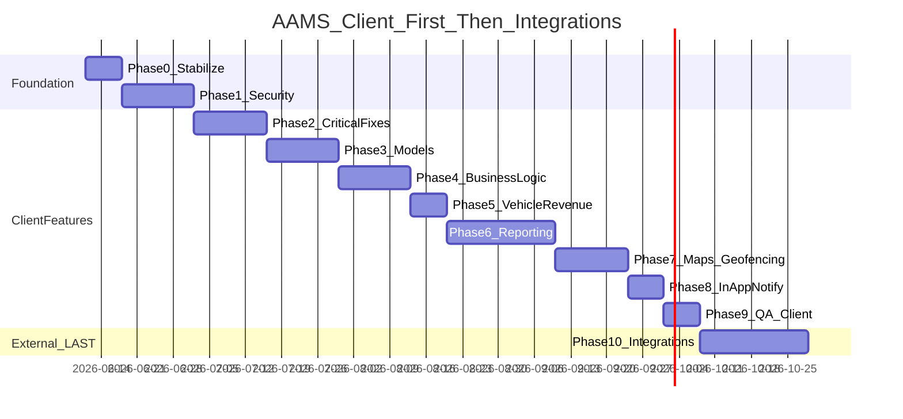

## حالة التنفيذ

| المرحلة | الحالة |
|---------|--------|
| 0 | مكتملة |
| 1–3 | مكتملة تقريباً |
| 4–8 | مكتملة تقريباً |
| 9 | جزئية (UAT + MOBILE_API) |
| 10 | مؤجلة |
# خطة الإصدار النهائي — AAMS (v2 — نهائية)

## ملخص تنفيذي

بعد نجاح الـ Demo، هذه الخطة تجمع الخطة الأصلية + **22 متطلب عميل** (مستبعد: **#10** دفع السائق، **#17** حساب الراتب).

**مبدأ الترتيب المعتمد:**
1. **أولاً:** كل تعديلات العميل + الأمان + المنطق + التقارير + الخرائط OSM — **بدون** اعتماد على مفاتيح أو خدمات خارجية.
2. **أخيراً (المرحلة 10 فقط):** كل التكاملات الخارجية — Google Maps، Push/SMS/WhatsApp، Redis، S3، deploy إنتاجي نهائي.

**المدة التقديرية:** 16–18 أسبوع.

**مخرجات التوثيق (عند التنفيذ):**
- [`docs/ROADMAP.md`](docs/ROADMAP.md)
- [`docs/CLIENT_DELIVERABLES.md`](docs/CLIENT_DELIVERABLES.md)
- [`docs/PRODUCTION_DEPLOY.md`](docs/PRODUCTION_DEPLOY.md)
- تحديث [`aams_requirements_audit.md`](aams_requirements_audit.md) و [`backend/docs/MOBILE_API.md`](backend/docs/MOBILE_API.md)

---

## قرارات معتمدة

| # | القرار |
|---|--------|
| **#9 استأذانات** | موديل جديد `PermissionRequest` — بدون خصم مالي |
| **#12 حوادث/طوارئ** | فصل UI/فلاتر فقط (`ACCIDENT` vs `MEDICAL`) |
| **#15 وقود/كم** | الأدمن يحدد لتر/100كم؛ الباكند يحسب الفعلي vs المتوقع |
| **#16 سوبرفايزر** | يرى **كل السائقين** — تعديل [`recordAccess.js`](backend/src/utils/recordAccess.js) |
| **#10، #17** | خارج النطاق |

---

## ما يُعتبر «تكامل خارجي» (المرحلة 10 فقط)

| تكامل | لماذا خارجي |
|-------|-------------|
| Google Maps API | مفتاح + billing من العميل |
| FCM HTTP v1 / Expo Push | Service Account + EAS |
| SMS (Twilio/Unifonic/…) | API keys + sender |
| WhatsApp Business API | Meta Cloud + templates معتمدة |
| Redis | بنية تحتية للـ socket multi-instance |
| S3/MinIO | تخزين ملفات الإنتاج |
| TLS + nginx + domain نهائي | infra العميل |
| إلغاء STATIC_OTP في prod | قرار deploy |

**ما يُنفَّذ قبل المرحلة 10 (بدون تكامل خارجي):**
- OSM/Leaflet + socket fleet map (instance واحدة)
- Geofencing logic + تنبيهات في جدول `Notification` (بدون push فعلي)
- PDF/Excel export (مكتبات محلية)
- رفع ملفات local disk في staging (S3 يُفعَّل في المرحلة 10)

---

## مصفوفة المتطلبات → المراحل

| # | المتطلب | المرحلة |
|---|---------|---------|
| 1 | أنواع رخص جديدة | 3 |
| 2 | إصلاح إنشاء الشفت | 2 |
| 3 | منصات + حساب احتياطي | 3 |
| 4 | تاريخ توزيع العمل per platform/account | 3 |
| 5 | «أخرى» + input تفاصيل | 3 |
| 6 | إصلاح تحقيقات | 2 |
| 7 | إصلاح edit endpoints | 2 |
| 8 | عهد (شريحة، جوال، خوذة…) | 3 |
| 9 | استأذانات (PermissionRequest) | 3 |
| 11 | إشعارات سائق + سوبرفايزر | 8 in-app → 10 push |
| 12 | فصل حوادث/طوارئ UI | 4 |
| 13 | فلتر زمني كل صفحة + export | 6 |
| 14 | طباعة تقرير بستايل | 6 |
| 15 | لترات vs كم | 4 |
| 16 | سوبرفايزر يرى كل السائقين | 4 |
| 18 | PDF/Excel شامل | 6 |
| 19 | فلتر إجازات بالتاريخ | 4 |
| 20 | socket كل الموظفين على خريطة | 7 |
| 21 | دخل المركبة المتكامل | 5 |
| 22 | Excel template import/export | 6 |
| 23 | فلاتر تقارير شاملة | 6 |
| 24 | select صفوف + تنزيل | 6 |

---

## المراحل — ترتيب التنفيذ

### المرحلة 0 — تثبيت baseline (أسبوع 1)

- Deploy آخر backend + dashboard.
- إنشاء `docs/ROADMAP.md`، `CLIENT_DELIVERABLES.md`، `backend/.env.example`.
- تحديث `aams_requirements_audit.md`.
- Tag: `v0.9-demo-stable`.

---

### المرحلة 1 — أمان P0 (أسبوع 1–2) — blocking

- فصل `adminPerm` / `sharedPerm` — scoping documents، reports، platform verify، violations، …
- Socket JWT في handshake ([`socket/index.js`](backend/src/socket/index.js)) — **بدون Redis adapter بعد**
- hardening staging: seed passwords، `CORS_ORIGIN` (STATIC_OTP يُلغى في المرحلة 10 prod)

**قبول:** سائق → 403 على mutations إدارية.

---

### المرحلة 2 — إصلاحات حرجة (#2, #6, #7) (أسبوع 2–3)

| # | العمل |
|---|------|
| **#2** | إصلاح `POST /shifts` للسائق |
| **#6** | investigations create/update/open + مرفقات |
| **#7** | audit كل `PATCH/PUT` + إصلاح dashboard forms → `docs/EDIT_ENDPOINTS_AUDIT.md` |

---

### المرحلة 3 — موديلات وبيانات العميل (#1, #3–5, #8, #9) (أسبوع 3–5)

| # | العمل |
|---|------|
| **#1** | توسيع `LicenseType` + migration |
| **#3** | منصات متكاملة + primary/alternate workflow |
| **#4** | `PlatformAccountWorkHistory` + timeline |
| **#5** | pattern `OTHER` + `otherDetails` عبر modules |
| **#8** | توسيع `AssetType` + UI عهد كامل |
| **#9** | `PermissionRequest` module + `/permission-requests` API |

---

### المرحلة 4 — منطق الأعمال (#12, #15, #16, #19 + audit) (أسبوع 5–7)

| # / audit | العمل |
|-----------|------|
| **#12** | تبويبات حوادث vs طوارئ في الداشبورد |
| **#15** | `FuelEfficiencyConfig` + تقرير لتر/100كم |
| **#16** | سوبرفايزر يرى كل السائقين في [`recordAccess.js`](backend/src/utils/recordAccess.js) |
| **#19** | فلتر إجازات `from`/`to`/`date` |
| 4.5–4.6 | وقود ثاني مشروط؛ إيصال إلزامي |
| 7.7 | مرفق إجازة مرضية إلزامي |
| 5.5, 8.5, 9.2 | أداء منصة، تقييم تلقائي، تنبيه أداء |

---

### المرحلة 5 — دخل المركبة (#21) (أسبوع 7–8)

- `VehicleFinancialSummary` من daily reports + shifts + fuel + maintenance.
- تبويب «المالية» في صفحة المركبة.
- ربط بكفاءة الوقود (#15).

---

### المرحلة 6 — التقارير والتصدير (#13, #14, #18, #22, #23, #24) (أسبوع 8–11)

- `ReportFilterBar` — فلتر زمني + فلاتر متعددة في كل صفحة (**#13**).
- طباعة/PDF بستايل موحد (**#14**, **#18**).
- Excel template export/import (**#22**).
- `GET /reports/advanced` (**#23**).
- `DataTable` select + `POST /export/selected` (**#24**).

---

### المرحلة 7 — خرائط OSM + تتبع + geofencing (بدون Google/Redis) (أسبوع 10–12)

| موضوع | العمل |
|-------|------|
| **#20** | Fleet Live Map — كل السائقين على خريطة (socket + REST polling) |
| OSM | zone polygons من `Zone.boundary` |
| Geofencing | point-in-polygon عند `POST /geofencing/locations` |
| Breach | إنشاء `Notification` في DB فقط (بدون push) |
| Crons | idle 40 دقيقة، disconnect heartbeat |
| شفت | تحرك 1 كم (اختياري)، حد 6 ساعات |

---

### المرحلة 8 — إشعارات in-app (#11) (أسبوع 11–12)

- `notificationDispatcher.js` — event-driven hooks لكل الأحداث.
- تخزين في `Notification` + عرض في dashboard/mobile list.
- **لا Push / SMS / WhatsApp هنا** — يُفعَّل في المرحلة 10.

---

### المرحلة 9 — QA ميزات العميل (أسبوع 12–13)

- Zod validators للمسارات الحرجة.
- Security tests + integration tests.
- CI: dashboard build + backend tests.
- **UAT checklist** لكل بنود العميل (1–9, 11–16, 18–24).
- تحديث Postman + MOBILE_API.md.

**معيار:** كل ميزات العميل تعمل end-to-end على staging **بدون** مفاتيح خارجية.

---

### المرحلة 10 — التكاملات الخارجية + الإنتاج النهائي (أخيرة) (أسبوع 13–16)

**كل ما يعتمد على العميل/infra — لا يُبدأ قبل إغلاق المرحلة 9.**

| تكامل | العمل |
|-------|------|
| **Google Maps** | `VITE_MAP_PROVIDER=google` عند تسليم المفتاح |
| **Push** | FCM HTTP v1 + Expo؛ ربط dispatcher بالقنوات |
| **SMS** | `channels/smsProvider.js` |
| **WhatsApp** | `channels/whatsappProvider.js` |
| **Redis** | Socket.io adapter + throttle multi-instance |
| **S3** | `STORAGE_DRIVER=s3` + migration ملفات |
| **Deploy** | `PRODUCTION_DEPLOY.md`: MySQL migrate، nginx+TLS، PM2/Docker، health، monitoring |
| **Prod hardening** | إلغاء STATIC_OTP، seed passwords production |
| **UAT نهائي** | push على جهاز حقيقي، SMS/WA اختبار، geofence → push، socket 2+ instances |
| **Tag** | `v1.0.0` |

---

## ترتيب التنفيذ (Gantt)

```mermaid
flowchart LR
  subgraph clientWork [مراحل_1_9_ميزات_العميل]
    Sec[Security_P0]
    Fixes[Fixes_2_6_7]
    Models[Models_1_3_9]
    Logic[Logic_12_15_16_19]
    Vehicle[Vehicle_21]
    Reports[Reports_13_24]
    Maps[OSM_Geo_20]
    NotifyDB[InApp_11]
    QA[UAT_Client]
    Sec --> Fixes --> Models --> Logic --> Vehicle --> Reports --> Maps --> NotifyDB --> QA
  end
  subgraph external [المرحلة_10_أخيرة]
    Google[Google_Maps]
    Push[FCM_SMS_WA]
    Infra[Redis_S3_Deploy]
    QA --> Google --> Push --> Infra
  end
```

---

## تسليمات العميل — متى نحتاجها

| التسليم | مطلوب قبل |
|---------|-----------|
| قائمة أنواع الرخص (#1) | المرحلة 3 |
| أنواع عهد إضافية (#8) | المرحلة 3 |
| لتر/100كم افتراضي (#15) | المرحلة 4 |
| Google Maps API Key | **المرحلة 10** |
| FCM / Expo / SMS / WhatsApp | **المرحلة 10** |
| S3 + Redis + domain + TLS | **المرحلة 10** |

---

## تقسيم المسؤوليات

| الفريق | المراحل 0–9 | المرحلة 10 |
|--------|-------------|------------|
| **Backend** | API، Prisma، logic، export، OSM socket | FCM/SMS/WA، Redis، S3 |
| **Dashboard** | forms، filters، reports، OSM maps | Google Maps layer |
| **Mobile** | permission-requests، socket GPS | push token، Google SDK |
| **العميل/Infra** | قرارات محتوى | كل المفاتيح والـ infra |
| **QA** | UAT بعد كل phase | UAT إنتاج نهائي |

---

## ملاحظة الموبايل

**لا تعديل** لـ: incidents، platform accounts، daily reports، HEIC.

**قبل المرحلة 10:** شاشة استأذان (#9)، socket heartbeat.

**المرحلة 10 فقط:** Google Maps SDK، push production.

---

## خارج النطاق

- **#10** — دفع السائق + دليل تحويل
- **#17** — حساب الراتب
